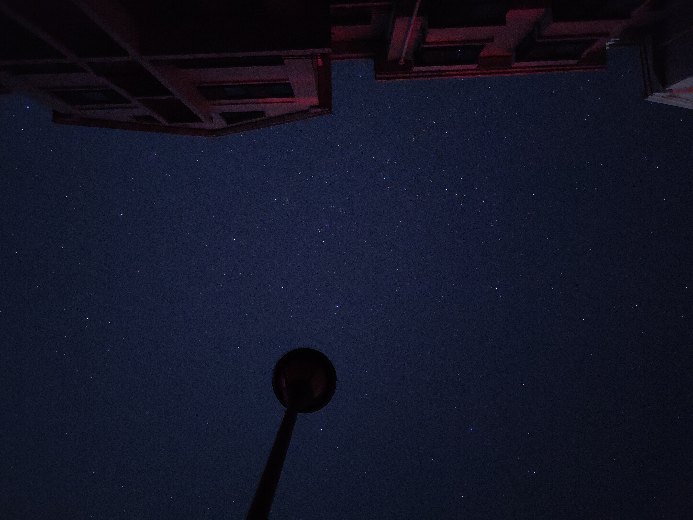
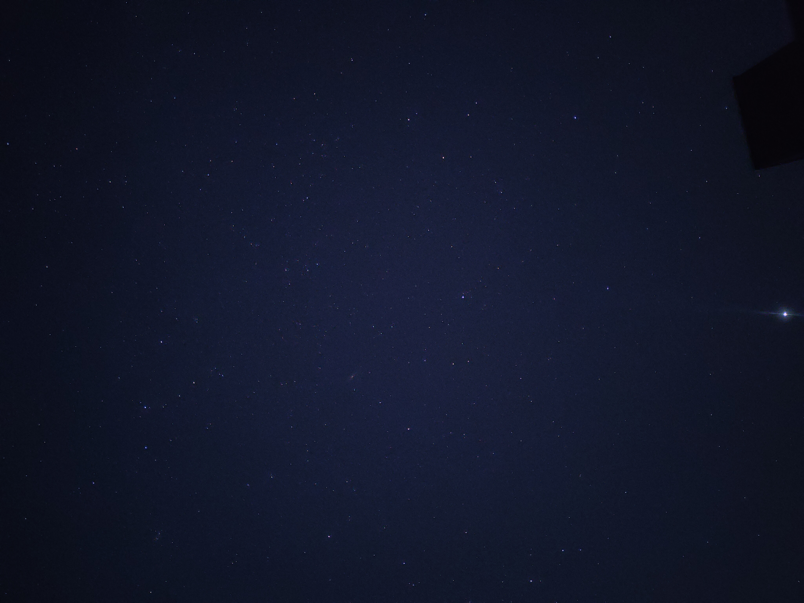

- #活着为了讲述/时间
	- 2022年08月23日01时38分 今天好好的捋了一遍缓存机制，梳理完发现已经这个点了。虽然有点累，但是有一种意犹未尽的满足感。
		- 回到家后，我诧异于所看到的天空。我真想躺在草地上，好好看看这个我无暇欣赏的世界。漫天的星星让我平静了好多。我知道，我必须相信自己。 
		  
		  
- #活着为了讲述/时间
  :LOGBOOK:
  CLOCK: [2022-08-23 Tue 09:45:51]
  CLOCK: [2022-08-23 Tue 09:45:55]
  :END:
	- 考研失利后，我感觉我的时间就此中止了，但别人的时间却似乎跑得飞快。上岸的谈论着新的城市，新的学校，新的理想。去了太原之后，我更茫然了。不紧不慢的表被拿走，换成了一个计时器。所有的人包括自己都在催促着我，一定要在什么时间内做到什么事。