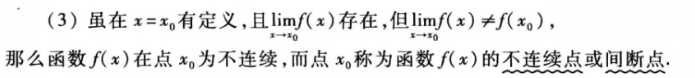

- #2023考研/数学/易错点
	- ## 铅直渐近线、无穷间断点、极限定义
		- ### 铅直渐近线
			- 
			- 满足$\lim _{x \rightarrow x_{0}} f(x) \rightarrow \infty \text { 或 } \lim _{x \rightarrow x_{0}^{+}} f(x) \rightarrow \infty \text { 或 } \lim _{x \rightarrow x_{0}^{-}} f(x) \rightarrow \infty$其中一种情况即可
		- ### 无穷间断点
			- #### 什么是间断点?
				- 间断点即不连续点
				  id:: 6332a415-7185-4181-88a4-649ff917b7db
				   
			- #### 什么是无穷间断点
				- 左右极限至少一个是无穷,并且满足间断点定义→ ((6332a415-7185-4181-88a4-649ff917b7db))
-
-