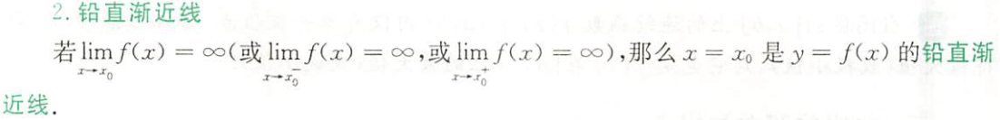
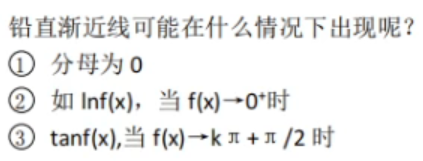
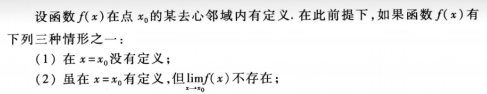
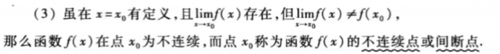
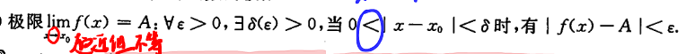

- #2023考研/数学/易错点
	- ## 铅直渐近线、无穷间断点、极限定义
		- > [一个求间断点的易错点【考研数学】|求间断点和找铅直渐近线的相似与区别](https://www.bilibili.com/video/av714554345/?vd_source=6b927c18188d6ef677a0d82692725653)
		- ### 铅直渐近线
			- 
			- 满足$\lim _{x \rightarrow x_{0}} f(x) \rightarrow \infty \text { 或 } \lim _{x \rightarrow x_{0}^{+}} f(x) \rightarrow \infty \text { 或 } \lim _{x \rightarrow x_{0}^{-}} f(x) \rightarrow \infty$其中一种情况即可
			- 
				- 1️⃣,分母可以出现在 ==指数位置== ,如 $e^{\frac{1}{x}}$
				- 3️⃣,说明铅直渐近线可以有无数条
		- ### 无穷间断点
			- #### 什么是间断点?
				- 间断点即不连续点
				  id:: 6332a415-7185-4181-88a4-649ff917b7db
				   
				  
					- 函数在==去心邻域内有定义==
			- #### 什么是无穷间断点
				- 左右极限至少一个是无穷,并且满足间断点定义→ ((6332a415-7185-4181-88a4-649ff917b7db))
			- ### 在某点处函数极限定义
				- 
				- 要求：
					- 去心邻域
					- 该邻域内==处处有定义==，有个==经典反例==$\lim\limits_{x\rightarrow\infty}\frac{sin(xsin \frac{1}{x})}{xsin \frac{1}{x}}$
					- ε≠0,在这个去心邻域内,==函数值是无限趋近于极限值 A 但不等的==,我们只是用这样一个符号表示函数值在这个去心邻域内的一种逼近关系