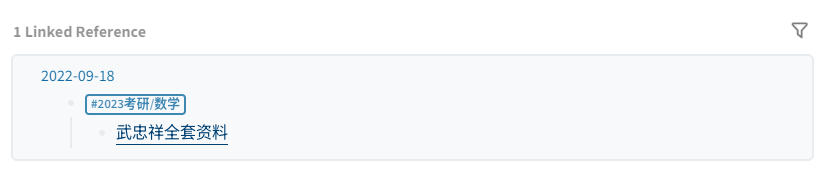

- # 如何使用
	- ## 链接到此页的页面有两种（即最底部的两种链接)：
		- 
			- 分类页，即`Hierarchy`下的子页，如政治，数学，英语等资料，推荐从这些页面找自己需要的资料！！！
			- 直接链接到本页的页面，即`linked Reference` 下页面，有点乱，不是很推荐
			  id:: 6326bba5-5ea6-4138-ab51-b59e69fb229b
	- ## 怎样看最近更新了什么东西？
		- 可以观察到，`linked Reference`资料都是有日期的。因此可以根据发布日期判断哪些资料是最新的。 
- # 资源汇总
- <iframe src="https://www.kdocs.cn/l/caeAtwilgTMz?su=n9gnlo" width="10"height="800"></iframe>