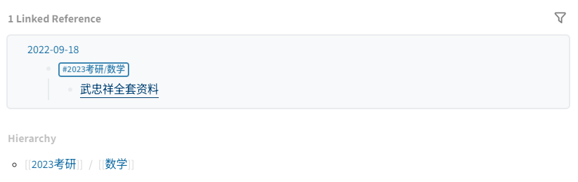

- # 如何使用
	- ## 链接到此页的页面有两种（即最底部的两种链接)：
		- 
		- 分类页，即``，如政治，数学，英语等资料
		- 总资源汇总页
		  id:: 6326bba5-5ea6-4138-ab51-b59e69fb229b
- # 资源汇总
- <iframe src="https://www.kdocs.cn/l/caeAtwilgTMz?su=n9gnlo" width="10"height="800"></iframe>