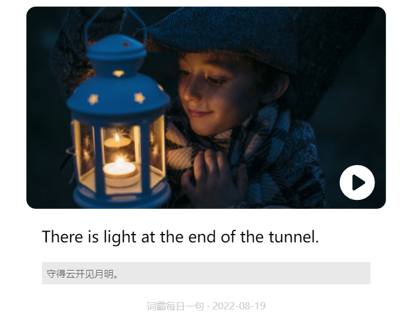

- <iframe src="https://notion.pet/view/index.html?q=d2fe6f20624088fe0276b7c664d33737.6d85a2b962ff707c1a7cd7a223d0932f" width="10"height="570"></iframe>
- > 英语：我曾经的痛
- English is a long-term topic to me which can be  traced back to twelve yeas ago.(I was 22 years old when I wrote this essay [on August 19 , 2022](logseq://graph/logseqPublish?page=%E8%8B%B1%E8%AF%AD%E4%B8%AD%E6%97%A5%E6%9C%9F%E8%A1%A8%E8%BE%BE)).So It means that I did not get  regular English instructions until fourth grade.
- In fact , it is common in the place of my nativity
-
-
- I used to perform badly in English.
- I was born in a
- yu yan shi wuzuide
- fazineixindeganuueyouyong
- 了解对世界的看法
- 
- # 资源获取
- {{video https://www.bilibili.com/video/BV17P4y1w7wq?spm_id_from=333.337.search-card.all.click&vd_source=6b927c18188d6ef677a0d82692725653}}
-