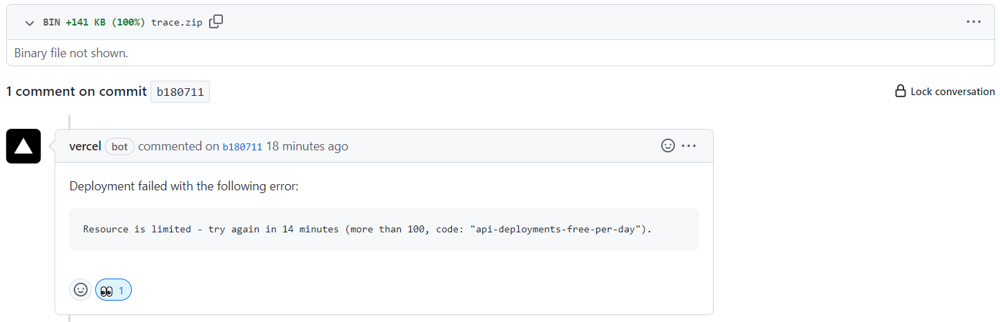

- ## 访客地球：
- ```html
  <script type="text/javascript" src="//rf.revolvermaps.com/0/0/6.js?i=5wmg8mtp9cw&amp;m=7&amp;c=e63100&amp;cr1=ffffff&amp;f=arial&amp;l=0&amp;bv=90&amp;lx=-420&amp;ly=420&amp;hi=20&amp;he=7&amp;hc=a8ddff&amp;rs=80" async="async"></script>
  ```
	- 事实证明，Logseq 无法内嵌原生 `HTML` 只能内嵌 [hiccup](https://docs.logseq.com/#/page/hiccup) 样式的简单魔改版 HTML
	- Github 上关于 hiccup 的介绍：[hiccup(github)](https://github.com/weavejester/hiccup/wiki/Syntax)
	- 一定注意 main.yml 中缩进问题，否则 actions 容易报错（原理未知）#error
-
- ## 评论系统
- 使用 github 的 discussion 功能
	- 在发布页所在仓库的 setting 中打开 discussion
- 需要整合 giscus （似乎抄的代码里无需整合了？）
-
- ## Vercel 资源限制
  heading:: true
- 有时候 Logseq 发布库会报错：
	- ```github
	  Deployment failed with the following error:
	  
	  Resource is limited - try again in 14 minutes (more than 100, code: "api-deployments-free-per-day").
	  ```
	- like this 
	- 原因：当 Vercel 关联的 Github 库有更新时，Vercel 会自动重新拉取代码，并重新构建部署，但是 Vercel 对发布的时间间隔有限制，两次重新部署的时间能太短。出现上面的报错不要慌，根据上图中提示的时间重新 push 一下就行。
- ## Notion 组件
- 采用 iframe 嵌入
	- ```HTML
	  <iframe src="填入组件库链接" width="160"height="150"></iframe>
	  ```
- <iframe src="https://notion.pet/view/index.html?q=d2fe6f20625684c30693e38225476a10.6842667962fb7a7e0e2a3bc434531740" width="160"height="130"></iframe>
-
-