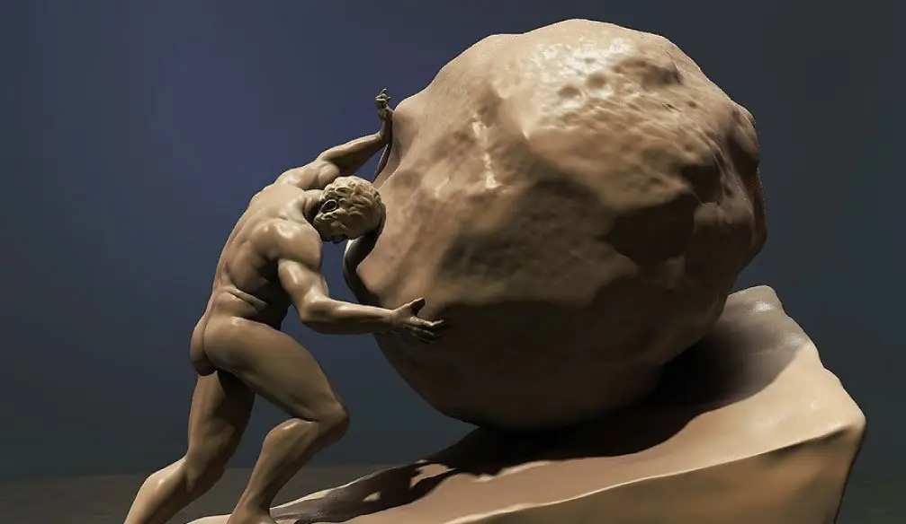

- 
	- 没人知道西西弗斯推动巨石时是感到无尽的重来的痛苦，还是艰难向上的充实。如果没有存在，就没有所谓的意义吧。
		- 因此无论如何一定要活下去。活着才能有更多的时间思考。
		- 至少在不停推动巨石的过程中，体魄和意志变得强大。
		- 如果是被人逼胁着推动这块巨石。那我不禁要问：
		  是作为一个奴隶推动巨石，还是驯服自己，为了强大，而暂时忍耐，埋头不顾的向上呢？
	- [[加缪]]写过《西西弗斯的神话》。也许从他的著作中可以得到些许答案吧。